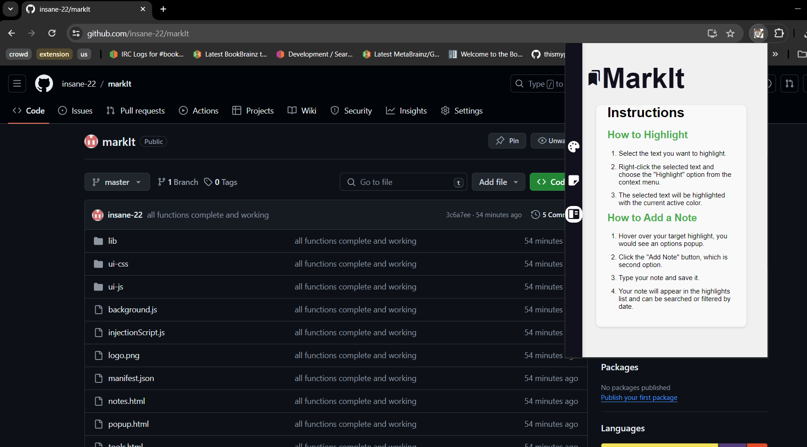
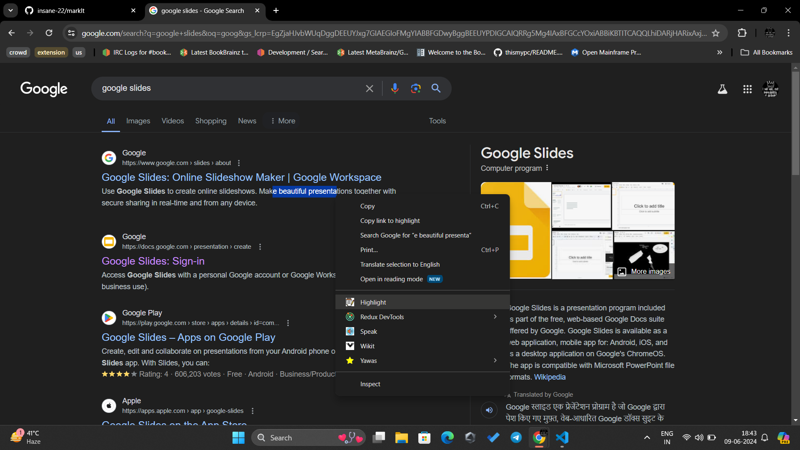
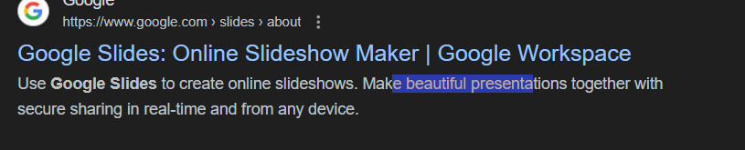
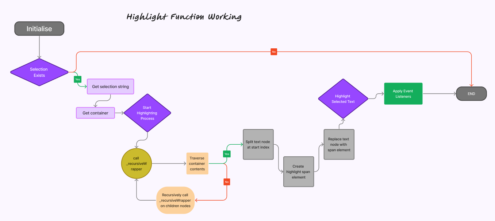
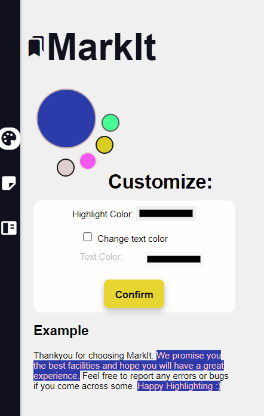
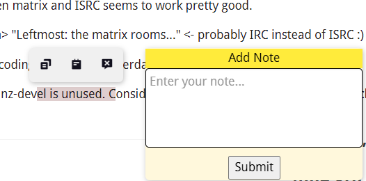
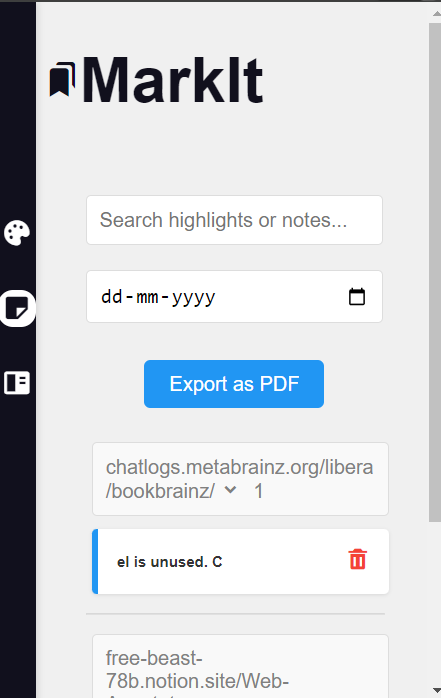
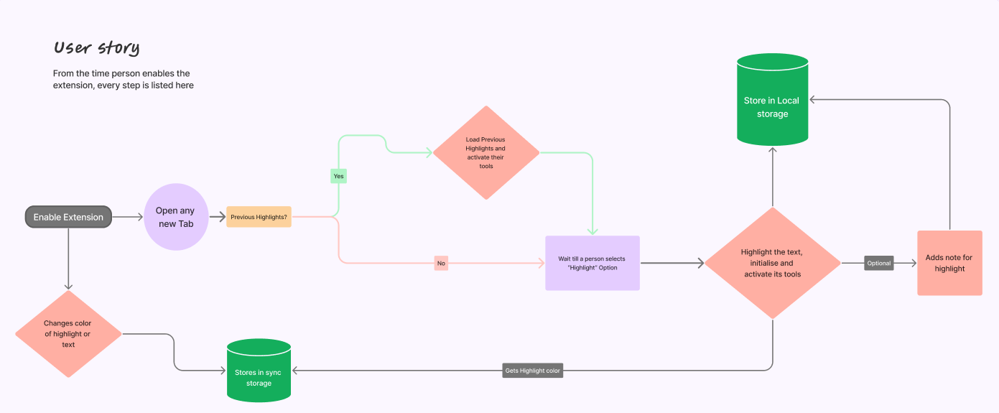

# markIt

## Overview

MarkIt is a web annotator Chrome extension that allows users to take important notes while reading through a web-page. It allows users to highlight pages with their favourite and customizable colors and add notes to the highlights for later references.

## Table Of Content

- [Installation](#installation)
- [Features](#features)
  - [Highlight](#highlight)
  - [Notes](#notes)
  - [Customize colors](#customize-colors)
- [User flow](#user-flow)

## Installation

You can follow these instructions to setup a dev environment:

- Clone the repository using the following command: `git clone https://github.com/insane-22/markIt.git`
- Open your Chrome browser and navigate to `chrome://extensions/`.
- In the top right corner of the extensions page, toggle the "Developer mode" switch to ON.
- Click on the "Load unpacked" button and select the directory where you cloned the repository
- The markIt extension should now appear in your list of Chrome extensions. Ensure it is enabled.
- You can open popup by clicking on the extension icon in the Chrome toolbar or pressing `Ctrl+B` from your keyboard.
- Read about mannual to use from "Instructions"

 
  

## Features :-

- Highlight selected content from different webpage
- Add multiple notes for future references
- Annotations persist across browser sessions
- Search and filter option based on keyword search or date on which highlight was added
- Provide options for users to customize highlight colors
- Allow users to export annotated pages with highlights and notes in the pdf form

### Highlight

In order to use this extension, select some text on webpage and right click on it. In the context menus you will see "Highlight" option, click on it and the selected text will be highlighted.

 
  

 
After selecting Highlight:-

 
  

 
A visual to represent the underhood processes when highlight option is selected:-

 
  

### Customize colors

MarkIt allows you to customize the colors of your highlights, providing a personalized and visually distinct way to organize your annotations.   
MarkIt comes with a set of default colors for highlighting. These can be used immediately after installation. In case you wanna customize it, click on the extension icon in the Chrome toolbar or pressing `Ctrl+B` from your keyboard and navigate to colors page by selecting color-palette icon from sidebar and choose color as you want.
This chosen color would be applied to your next highlights until you change it again.

 
  

### Notes

User can also hover ovr the highlighted text to get an options popup in which selecting second option will allow him to add notes to the highlight selected

 
  

After submitting the note, the user can access all the notes and highlights from the "highlights" tab in the sidebar of popup:-

 
  

The user can also filter notes based on date or keyword, allowing usrs to search for their required highlight or note.

### User Flow

A flow diagram to explain user-flow using the extension

 
  

